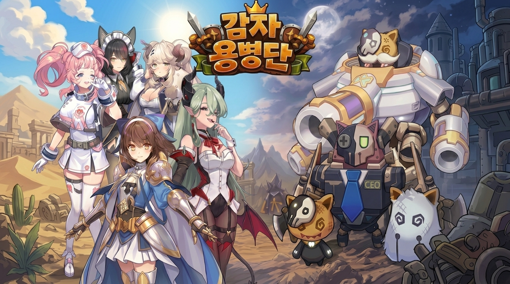

# 감자 원정대

> **모바일 자동 디펜스 RPG**  
> 다양한 유닛과 장비를 조합하여 스테이지를 클리어하고, 점차 전력을 강화해 나가는 게임입니다.

---

## 프로젝트 소개

**감자 원정대**는 **팔라독**을 레퍼런스로 한 **모바일 자동 디펜스 RPG**입니다.  
플레이어는 다양한 유닛과 장비를 활용해 스테이지를 돌파하며, 전투를 거듭할수록 더욱 강한 조합을 구성해 나가는 것을 목표로 합니다.

---

## 주요 기능

### 1. 병과별 유닛 AI
- 병과에 따라 서로 다른 전투 행동과 판단 로직을 수행하도록 구성
- 각 유닛의 역할이 전투 양상에 자연스럽게 반영되도록 설계

### 2. 장비 기반 스킬 시스템
- 장비 종류에 따라 서로 다른 스킬을 사용할 수 있도록 구현
- 장비 선택이 전투 스타일 변화로 이어지도록 구성

### 3. 세트 효과 기반 스킬 업그레이드
- 특정 장비 조합을 통해 추가 효과 또는 스킬 강화가 가능하도록 설계
- 단순 장비 착용을 넘어 조합의 재미를 느낄 수 있도록 구현

---

## 수행 업무

### GAS 활용 구조 설계
- 프로젝트 구조에 맞춘 Gameplay Ability System 설계 및 확장
- 공통 전투 기능과 데이터 흐름을 고려한 어빌리티 구조 구성

### 유닛 / 히어로 어빌리티 구현
- 유닛과 히어로의 스킬 및 전투 로직 구현
- 전투 상황에 맞춰 재사용 가능하도록 어빌리티 단위로 구성

---

## 주요 성과

### 1. 행동 단위 기반 전투 기능 구조화
전투 기능을 **Task 단위로 분리하고 조합할 수 있도록 설계**하여,  
다양한 스킬을 공통 구조 안에서 확장할 수 있는 기반을 마련했습니다.

### 2. 데이터 드리븐 구조 정리
캐릭터, 장비, 스킬 데이터를 분리한 **데이터 드리븐 구조**를 구축하여,  
콘텐츠 추가와 유지보수가 쉬운 형태로 정리했습니다.

### 3. GAS 공통 기능 확장
GAS의 기본 기능을 프로젝트 구조에 맞게 확장하여,  
**Gameplay Cue 정보 전달**, **데이터 기반 Cooldown 처리** 등 공통 기능의 활용 범위와 재사용성을 높였습니다.

### 4. 스킬 연출 구현
스킬의 타격감과 흐름이 자연스럽게 전달되도록  
각 어빌리티에 맞는 연출 요소를 구현했습니다.

### 5. 에디터 작업 흐름 개선
에디터 작업 흐름을 개선하여  
데이터 입력 과정의 편의성과 안정성을 높였습니다.

---

## 기술 스택

- **C++**
- **Unreal Engine 5**

---

## 핵심 키워드

`GAS` `Data-Driven` `에디터 편의성 개선`

---
