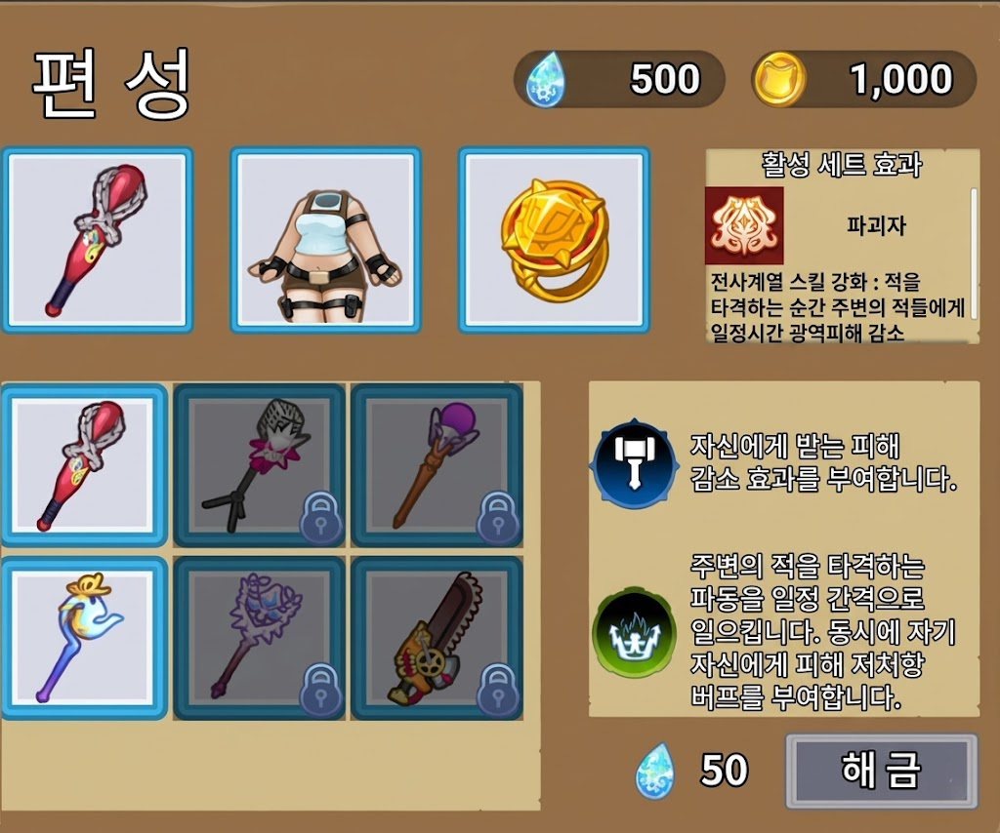
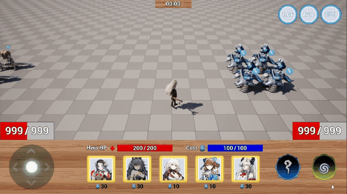
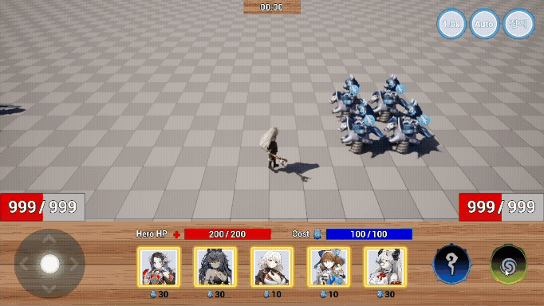

# 감자 원정대 (Potato Expedition)

  

## 프로젝트 개요

| 항목 | 내용 |
|---|---|
| 개발 기간 및 인원 | 2026.02.02 ~ 2026.04.03, 5인 |
| 사용 엔진 버전 | Unreal Engine 5.5 |
| 주요 라이브러리 | Gameplay Ability System (GAS) |
| 대상 플랫폼 | PC / Android |

## 프로젝트 소개

**감자 원정대**는 **팔라독**을 레퍼런스로 한 **모바일 자동 디펜스 RPG**입니다.  
플레이어는 다양한 유닛과 장비를 활용해 스테이지를 돌파하며, 전투를 거듭할수록 더 강한 조합을 구성해 나가는 것을 목표로 합니다.

## 주요 기능 소개

### 1) 병과별 유닛 AI
- 병과별로 서로 다른 전투 행동과 판단 로직을 수행하도록 구현
- 각 유닛의 역할이 전투 양상에 자연스럽게 반영되도록 설계
- 관련 구현: [유닛 캐릭터](./Source/Unreal_ProjectG/Private/Character/Unit/UnitCharacter.cpp), [AI 컨트롤러](./Source/Unreal_ProjectG/Private/Character/Unit/AI/UnitDetourCrowdAIController.cpp), [공격 Task](./Source/Unreal_ProjectG/Private/Character/Unit/Task/BTT_Attack.cpp), [아군 탐색 Task](./Source/Unreal_ProjectG/Private/Character/Unit/Task/BTT_FindAlly.cpp), [공격 범위 탐색 Task](./Source/Unreal_ProjectG/Private/Character/Unit/Task/BTT_SearchAttackArea.cpp), [근접 공격 어빌리티](./Source/Unreal_ProjectG/Private/AbilitySystem/Abilities/Unit/UnitAbility_BaseMeleeAttack.cpp), [투사체 어빌리티](./Source/Unreal_ProjectG/Private/AbilitySystem/Abilities/Unit/UnitAbility_SpawnProjectile.cpp), [지원형 어빌리티](./Source/Unreal_ProjectG/Private/AbilitySystem/Abilities/Unit/UnitAbility_Supporter.cpp)

### 2) 장비 기반 스킬 시스템

   
  장비 선택 창과 스킬 설명

- 장비 종류에 따라 서로 다른 스킬 사용 가능
- 장비 선택이 전투 스타일 변화로 이어지도록 구성
- 관련 구현: [장비 적용 컴포넌트](./Source/Unreal_ProjectG/Private/Components/Equipment/EquimentsStorageComponent.cpp), [무기 스킬 데이터](./Source/Unreal_ProjectG/Private/DataAssets/Items/DataAsset_WeaponData.cpp), [장신구 스킬 데이터](./Source/Unreal_ProjectG/Private/DataAssets/Items/DataAsset_AccessoryData.cpp)

### 3) 세트 효과 기반 스킬 업그레이드

<table>
  <tr>
    <td align="center">
       
      세트 효과 적용 전
    </td>
    <td align="center">
       
      세트 효과 적용 후
    </td>
  </tr>
</table>

- 특정 장비 조합을 통해 추가 효과 및 스킬 강화 가능
- 단순 장비 착용을 넘어 조합의 재미를 제공
- 관련 구현: [히어로 스킬 런타임 빌드](./Source/Unreal_ProjectG/Private/DataAssets/Ability/DataAsset_HeroSkillData.cpp), [세트 조건 판정](./Source/Unreal_ProjectG/Private/PGFunctionLibrary.cpp)

### 4) 행동 단위 기반 전투 기능 구조
- 전투 기능을 Task 단위로 분리해 조합 가능한 구조로 설계
- 다양한 스킬을 공통 프레임 안에서 확장 가능하도록 구현
- 관련 구현: [히어로 스킬 실행 흐름](./Source/Unreal_ProjectG/Private/AbilitySystem/Abilities/Hero/PGHeroSkillGameplayAbility.cpp), [공통 스킬 Task](./Source/Unreal_ProjectG/Private/AbilitySystem/AbilityTasks/SkillAbilityTask.cpp), [근접 판정 Task](./Source/Unreal_ProjectG/Private/AbilitySystem/AbilityTasks/SkillAbilityTask_MeleeTrace.cpp), [액터 생성 Task](./Source/Unreal_ProjectG/Private/AbilitySystem/AbilityTasks/SkillAbilityTask_SpawnActor.cpp), [버프 Task](./Source/Unreal_ProjectG/Private/AbilitySystem/AbilityTasks/SkillAbilityTask_Buff.cpp)

### 5) 데이터 드리븐 콘텐츠 구조
- 캐릭터, 장비, 스킬 데이터를 분리해 관리하는 구조 적용
- 콘텐츠 추가 및 유지보수 효율 향상
- 관련 구현: [스킬 데이터](./Source/Unreal_ProjectG/Private/DataAssets/Ability/DataAsset_HeroSkillData.cpp), [무기 데이터](./Source/Unreal_ProjectG/Private/DataAssets/Items/DataAsset_WeaponData.cpp), [방어구 데이터](./Source/Unreal_ProjectG/Private/DataAssets/Items/DataAsset_ArmorData.cpp), [초기 데이터 부여](./Source/Unreal_ProjectG/Private/DataAssets/StartUp/DataAsset_StartupDataBase.cpp)

### 6) GAS 공통 기능 확장
- Gameplay Cue 정보 전달 구조 확장
- 데이터 기반 Cooldown 처리 등 공통 로직 재사용성 강화
- 관련 구현: [공통 GameplayAbility](./Source/Unreal_ProjectG/Private/AbilitySystem/Abilities/PGGameplayAbility.cpp), [GAS 유틸 함수](./Source/Unreal_ProjectG/Private/PGFunctionLibrary.cpp), [커스텀 EffectContext](./Source/Unreal_ProjectG/Private/AbilitySystem/Types/PGGameplayEffectContext.cpp), [AbilitySystemGlobals 확장](./Source/Unreal_ProjectG/Private/AbilitySystem/PGAbilitySystemGlobals.cpp), [Cooldown Effect](./Source/Unreal_ProjectG/Private/AbilitySystem/Effects/GEffect_Cooldown.cpp)

### 7) 에디터 작업 흐름 개선
- 반복 입력 구간을 정리해 데이터 작성 편의성 향상
- 작업 안정성 및 실수 방지 흐름 개선
- 관련 구현: [에디터 모듈 등록](./Source/PGEditor/PGEditor.cpp), [AbilityEntry 커스터마이징](./Source/PGEditor/Customization/AbilityEntryCustomization.cpp), [AttributeModifier 커스터마이징](./Source/PGEditor/Customization/AttributeModEntryCustomization.cpp)

## 수행 업무

### GAS 활용 구조 설계
- 프로젝트 구조에 맞춘 Gameplay Ability System 설계 및 확장
- 공통 전투 기능과 데이터 흐름을 고려한 어빌리티 구조 구성

### 유닛 / 히어로 어빌리티 구현
- 유닛과 히어로의 스킬 및 전투 로직 구현
- 전투 상황에 맞게 재사용 가능한 어빌리티 단위 구조로 정리
